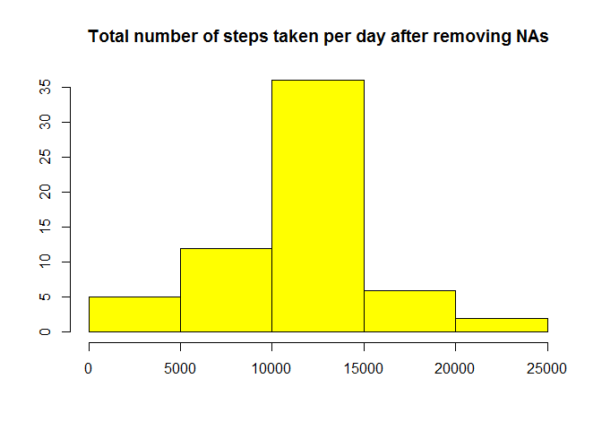

# Reproducible Research: Peer Assessment 1
#Introduction
It is now possible to collect a large amount of data about personal movement using activity monitoring devices such as a Fitbit, Nike Fuelband, or Jawbone Up. These type of devices are part of the “quantified self” movement – a group of enthusiasts who take measurements about themselves regularly to improve their health, to find patterns in their behavior, or because they are tech geeks. But these data remain under-utilized both because the raw data are hard to obtain and there is a lack of statistical methods and software for processing and interpreting the data.

This assignment makes use of data from a personal activity monitoring device. This device collects data at 5 minute intervals through out the day. The data consists of two months of data from an anonymous individual collected during the months of October and November, 2012 and include the number of steps taken in 5 minute intervals each day.

#Analysis

## Loading and preprocessing the data
At this step we download file with the given link and read it.

```r
url <- "https://d396qusza40orc.cloudfront.net/repdata%2Fdata%2Factivity.zip"
download.file(url, "activity.zip")
unzip("activity.zip", exdir="activity")
files <- list.files("activity")
filename <- paste("./activity/",files[1],sep="")
data <- read.csv(filename, header=TRUE)
head(data)
```

```
##   steps       date interval
## 1    NA 2012-10-01        0
## 2    NA 2012-10-01        5
## 3    NA 2012-10-01       10
## 4    NA 2012-10-01       15
## 5    NA 2012-10-01       20
## 6    NA 2012-10-01       25
```


## Mean total number of steps taken per day


```r
daySteps <- aggregate(data$steps, by=list(data$date), FUN="sum", na.rm=TRUE)
with( daySteps, hist (x,col="green", xlab="",ylab="", main="Total number of steps taken per day"))
```

<!-- -->

###The mean value of total number of steps taken per day:

```r
mean(daySteps$x)
```

```
## [1] 9354.23
```
### The median value of total number of steps taken per day:

```r
median(daySteps$x)
```

```
## [1] 10395
```

## The average daily activity pattern

```r
intervalSteps<- tapply(data$steps, data$interval, mean, na.rm=T)
plot(intervalSteps ~ unique(data$interval), type="l", xlab = "Interval", ylab="Mean value of steps", main="Mean value of number of steps teken per interval")
```

<!-- -->

###The 5-minute interval that, on average, contains the maximum number of steps:

```r
intervalSteps[which.max(intervalSteps)]
```

```
##      835 
## 206.1698
```


## Imputing missing values
Some steps data was missing. Let's imput averages from previous paragraph instead of NAs: 

```r
rmNAdata <- data  # creation of the dataset that will have no more NAs
for (i in 1:nrow(rmNAdata)){
    if(is.na(rmNAdata$steps[i])){
        rmNAdata$steps[i]<-intervalSteps[[as.character(rmNAdata[i,"interval"])]]
    }
}
```
Let's take a look at a histogram of the total number of steps taken each day after missing values are imputed:

```r
rmNAdaySteps <- aggregate(rmNAdata$steps, by=list(rmNAdata$date), FUN="sum")
with( rmNAdaySteps, hist (x,col="yellow", xlab="",ylab="", main="Total number of steps taken per day after removing NAs"))
```

<!-- -->

## Differences in activity patterns between weekdays and weekends
Cut data in 2 pieces: for weekdays and weekends.

```r
library(dplyr)
```

```
## Warning: package 'dplyr' was built under R version 3.3.2
```

```
## 
## Attaching package: 'dplyr'
```

```
## The following objects are masked from 'package:stats':
## 
##     filter, lag
```

```
## The following objects are masked from 'package:base':
## 
##     intersect, setdiff, setequal, union
```

```r
rmNAdata$date <- as.Date(strptime(rmNAdata$date, format="%Y-%m-%d", tz=""))
rmNAdata <- mutate(rmNAdata, wd=weekdays(rmNAdata$date))
weekend <- filter(rmNAdata, wd %in% c("суббота", "воскресенье",  "saturday", "sunday"))
weekday <- filter(rmNAdata,!(wd%in% c("суббота", "воскресенье", "saturday", "sunday")))
```
Show the average daily activity pattern for weekends and weekdays:

```r
library(lattice)
ISweekend<- tapply(weekend$steps, weekend$interval, mean)
ISweekday<- tapply(weekday$steps, weekday$interval, mean)
DFweekday <- data.frame(interval = unique(weekday$interval), avg = as.numeric(ISweekday), day = rep("weekday", length(ISweekday)))
DFweekend <- data.frame(interval = unique(weekend$interval), avg = as.numeric(ISweekend), day = rep("weekend", length(ISweekend)))
final <- rbind(DFweekday, DFweekend)

xyplot(avg ~ interval | day, data = final, layout = c(1, 2), 
       type = "l", ylab = "Number of steps", xlab="Interval", 
       main="Comparing the average number of steps across weekdays and weekends")
```

<!-- -->

