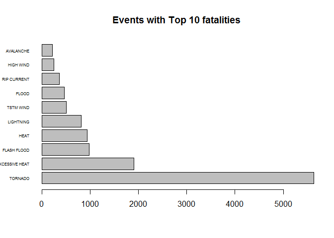
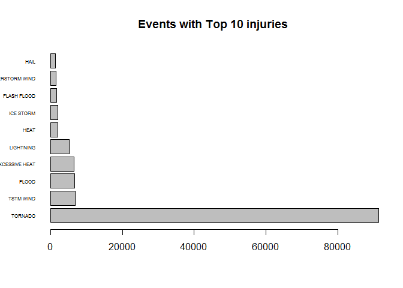
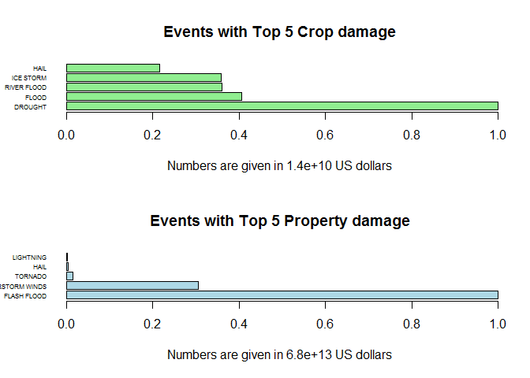

# Influence of events
Mariia Danilenko  
##Introduction

Storms and other severe weather events can cause both public health and economic problems for communities and municipalities. Many severe events can result in fatalities, injuries, and property damage, and preventing such outcomes to the extent possible is a key concern.

This project involves exploring the U.S. National Oceanic and Atmospheric Administration's (NOAA) storm database. This database tracks characteristics of major storms and weather events in the United States, including when and where they occur, as well as estimates of any fatalities, injuries, and property damage.

##Questions

Our data analysis will address the following questions:

1. Across the United States, which types of events are most harmful with respect to population health?
2. Across the United States, which types of events have the greatest economic consequences?

##Data processing.
###Download data with the given link.

```r
library(R.utils)
```

```
## Warning: package 'R.utils' was built under R version 3.3.2
```

```
## Loading required package: R.oo
```

```
## Warning: package 'R.oo' was built under R version 3.3.2
```

```
## Loading required package: R.methodsS3
```

```
## Warning: package 'R.methodsS3' was built under R version 3.3.2
```

```
## R.methodsS3 v1.7.1 (2016-02-15) successfully loaded. See ?R.methodsS3 for help.
```

```
## R.oo v1.21.0 (2016-10-30) successfully loaded. See ?R.oo for help.
```

```
## 
## Attaching package: 'R.oo'
```

```
## The following objects are masked from 'package:methods':
## 
##     getClasses, getMethods
```

```
## The following objects are masked from 'package:base':
## 
##     attach, detach, gc, load, save
```

```
## R.utils v2.5.0 (2016-11-07) successfully loaded. See ?R.utils for help.
```

```
## 
## Attaching package: 'R.utils'
```

```
## The following object is masked from 'package:utils':
## 
##     timestamp
```

```
## The following objects are masked from 'package:base':
## 
##     cat, commandArgs, getOption, inherits, isOpen, parse, warnings
```

```r
library(ggplot2)
```

```
## Warning: package 'ggplot2' was built under R version 3.3.2
```

```
## Warning: failed to assign NativeSymbolInfo for env since env is already
## defined in the 'lazyeval' namespace
```

```r
library(dplyr)
```

```
## Warning: package 'dplyr' was built under R version 3.3.2
```

```
## 
## Attaching package: 'dplyr'
```

```
## The following objects are masked from 'package:stats':
## 
##     filter, lag
```

```
## The following objects are masked from 'package:base':
## 
##     intersect, setdiff, setequal, union
```


```r
url <- "https://d396qusza40orc.cloudfront.net/repdata%2Fdata%2FStormData.csv.bz2"
download.file(url, "dataStorm.csv.bz2")
bunzip2("dataStorm.csv.bz2", "dataStorm.csv", remove = FALSE, skip = TRUE)
dataStorm <- read.csv("dataStorm.csv")
head(dataStorm)
```

```
##   STATE__           BGN_DATE BGN_TIME TIME_ZONE COUNTY COUNTYNAME STATE
## 1       1  4/18/1950 0:00:00     0130       CST     97     MOBILE    AL
## 2       1  4/18/1950 0:00:00     0145       CST      3    BALDWIN    AL
## 3       1  2/20/1951 0:00:00     1600       CST     57    FAYETTE    AL
## 4       1   6/8/1951 0:00:00     0900       CST     89    MADISON    AL
## 5       1 11/15/1951 0:00:00     1500       CST     43    CULLMAN    AL
## 6       1 11/15/1951 0:00:00     2000       CST     77 LAUDERDALE    AL
##    EVTYPE BGN_RANGE BGN_AZI BGN_LOCATI END_DATE END_TIME COUNTY_END
## 1 TORNADO         0                                               0
## 2 TORNADO         0                                               0
## 3 TORNADO         0                                               0
## 4 TORNADO         0                                               0
## 5 TORNADO         0                                               0
## 6 TORNADO         0                                               0
##   COUNTYENDN END_RANGE END_AZI END_LOCATI LENGTH WIDTH F MAG FATALITIES
## 1         NA         0                      14.0   100 3   0          0
## 2         NA         0                       2.0   150 2   0          0
## 3         NA         0                       0.1   123 2   0          0
## 4         NA         0                       0.0   100 2   0          0
## 5         NA         0                       0.0   150 2   0          0
## 6         NA         0                       1.5   177 2   0          0
##   INJURIES PROPDMG PROPDMGEXP CROPDMG CROPDMGEXP WFO STATEOFFIC ZONENAMES
## 1       15    25.0          K       0                                    
## 2        0     2.5          K       0                                    
## 3        2    25.0          K       0                                    
## 4        2     2.5          K       0                                    
## 5        2     2.5          K       0                                    
## 6        6     2.5          K       0                                    
##   LATITUDE LONGITUDE LATITUDE_E LONGITUDE_ REMARKS REFNUM
## 1     3040      8812       3051       8806              1
## 2     3042      8755          0          0              2
## 3     3340      8742          0          0              3
## 4     3458      8626          0          0              4
## 5     3412      8642          0          0              5
## 6     3450      8748          0          0              6
```
###Data review.
We are going to use only the following columns from the given data:  
 * EVTYPE - event type  
 * FATALITIES - applies to population health  
 * INJURIES - applies to population health   
* CROPDMG - crop damage  
* CROPDMGEXP - crop damage exponential   
* PROPDMG - property damage  
* PROPDMGEXP - property damage exponential  

Other columns are not applicable to our questions, that's why we will select
only these information for the next steps.

```r
selStorm <- select(dataStorm, EVTYPE, FATALITIES, INJURIES, CROPDMG, CROPDMGEXP,PROPDMG, PROPDMGEXP )
head(selStorm)
```

```
##    EVTYPE FATALITIES INJURIES CROPDMG CROPDMGEXP PROPDMG PROPDMGEXP
## 1 TORNADO          0       15       0               25.0          K
## 2 TORNADO          0        0       0                2.5          K
## 3 TORNADO          0        2       0               25.0          K
## 4 TORNADO          0        2       0                2.5          K
## 5 TORNADO          0        2       0                2.5          K
## 6 TORNADO          0        6       0                2.5          K
```


###Convert given damage into human readable numbers.
Two columns (CROPDMGEXP and PROPDMGEXP) should contain encrypt numbers:  
 * K - for thousands;  
 * M - for millions;  
 * H - for hundrites;  
 * B - for billions.  
The initial formula for __Property damage__ is PRPTDMG×PROPDMGEXP.  
The initial formula for __Crop damage__ is CROPDMG×CROPDMGEXP.  

But let's analyze values from these columns:  

```r
unique(selStorm$PROPDMGEXP)
```

```
##  [1] K M   B m + 0 5 6 ? 4 2 3 h 7 H - 1 8
## Levels:  - ? + 0 1 2 3 4 5 6 7 8 B h H K m M
```

```r
unique(selStorm$CROPDMGEXP)
```

```
## [1]   M K m B ? 0 k 2
## Levels:  ? 0 2 B k K m M
```
Based on the new information construct function switch_vec which helps convert symbols into powers of 10.  

```r
switch_vec<- function(x) {
    if (x %in% c('h', 'H'))
        return(2)
    else if (x %in% c('k', 'K'))
        return(3)
    else if (x %in% c('m', 'M'))
        return(6)
    else if (x %in% c('b', 'B'))
        return(9)
    else if (!is.na(as.numeric(x)))
        return(as.numeric(x))
    else if (x %in% c('', '-', '?', '+'))
        return(0)
    else {
        stop("Error")
    }
}
```
Only now we can calculate damage values.  

```r
economy <- selStorm
economy$CROPDMGEXP <- sapply(economy$CROPDMGEXP, switch_vec)
economy$PROPDMGEXP <- sapply(economy$PROPDMGEXP, switch_vec)

economy$CROPDMG <- economy$CROPDMG*(10**economy$CROPDMGEXP)
economy$PROPDMG <- economy$PROPDMG*(10**economy$PROPDMGEXP)
```
##Analysis.
### Types of events which are most harmful with respect to population health.

At the begining we have to sum all fatalities and all injuries for each event type.   
For our purpose we don't need to work with events with no fatalities or injuries. Let's filter our data and choose only baneful types of events.  

```r
health<- aggregate(cbind(as.numeric(selStorm$FATALITIES),
                         as.numeric(selStorm$INJURIES)), 
                   by=list(selStorm$EVTYPE), FUN="sum" )
health_final<-filter(health, !((V1==0)&(V2==0)))
```

#### Top 10 for fatalities
Arrange our new data to select Top 10 events with the biggest amount of fatalities.  

```r
health_Fat<- arrange(health_final, desc(V1))
health_Fat_top <- health_Fat[1:10,]
par(mfcol=c(1,1))
barplot(health_Fat_top$V1, names.arg = health_Fat_top$Group.1, horiz =TRUE, las=1, cex.names = 0.5, main="Events with Top 10 fatalities")
```

<!-- -->

#### Top 10 for injuries
Arrange our new data to select Top 10 events with the biggest amount of injuries.  

```r
health_Inj<- arrange(health_final, desc(V2))
health_Inj_top <- health_Inj[1:10,]
par(mfcol=c(1,1))
barplot(health_Inj_top$V2, names.arg = health_Inj_top$Group.1, horiz =TRUE, las=1, cex.names = 0.5, main="Events with Top 10 injuries")
```

<!-- -->
  
### Types of events which have the greatest economic consequences  
Aggregate two types of damage by event type.  

```r
economy_final<- aggregate(cbind(economy$CROPDMG,economy$PROPDMG), 
                   by=list(economy$EVTYPE), FUN="sum" )
```
At this moment we can select Top 5 events for each type of damage:    

```r
par(mfcol=c(2,1))

economy_final <- arrange(economy_final, desc(V1))
economy_crop=economy_final[1:5,]
barplot(economy_crop$V1/economy_crop$V1[1], names.arg = economy_crop$Group.1, horiz =TRUE, las=1, cex.names = 0.5,col="lightgreen", main="Events with Top 5 Crop damage", xlab="Numbers are given in 1.4e+10 US dollars")

economy_final <- arrange(economy_final, desc(V2))
economy_prop=economy_final[1:5,]
barplot((economy_prop$V2 / economy_prop$V2[1]), names.arg = economy_prop$Group.1, horiz =TRUE, las=1, cex.names = 0.5,col="lightblue", main="Events with Top 5 Property damage",xlab="Numbers are given in 6.8e+13 US dollars")
```

<!-- -->

##Results.  
###Types of events which are most harmful with respect to population health  
The Top 10 for fatalities is:  

```r
names(health_Fat_top)<-c("EvType", "Fatalities", "Injuries")
health_Fat_top[1:10,]
```

```
##            EvType Fatalities Injuries
## 1         TORNADO       5633    91346
## 2  EXCESSIVE HEAT       1903     6525
## 3     FLASH FLOOD        978     1777
## 4            HEAT        937     2100
## 5       LIGHTNING        816     5230
## 6       TSTM WIND        504     6957
## 7           FLOOD        470     6789
## 8     RIP CURRENT        368      232
## 9       HIGH WIND        248     1137
## 10      AVALANCHE        224      170
```
The Top 10 for injuries is:  

```r
names(health_Inj_top)<-c("EvType", "Fatalities", "Injuries")
health_Inj_top[1:10,]
```

```
##               EvType Fatalities Injuries
## 1            TORNADO       5633    91346
## 2          TSTM WIND        504     6957
## 3              FLOOD        470     6789
## 4     EXCESSIVE HEAT       1903     6525
## 5          LIGHTNING        816     5230
## 6               HEAT        937     2100
## 7          ICE STORM         89     1975
## 8        FLASH FLOOD        978     1777
## 9  THUNDERSTORM WIND        133     1488
## 10              HAIL         15     1361
```
We can't compare fatality and injury that's why we won't analyse the sum.  
Also, we can recognize that Tornado is the most influential event is the US.   Notice, that we calculated the sums of deaths and sufferers not the means.    
### Types of events which have the greatest economic consequences  
The Top 5 for Crop damage is:

```r
names(economy_crop)<-c("EvType", "CropDMG", "PropDMG")
economy_crop[1:5,]
```

```
##        EvType     CropDMG      PropDMG
## 1     DROUGHT 13972566000   1046106000
## 2       FLOOD  5661968450 144657709870
## 3 RIVER FLOOD  5029459000   5118945500
## 4   ICE STORM  5022113500   3949927810
## 5        HAIL  3025974480 315755837790
```
The Top 5 for Property damage is:

```r
names(economy_prop)<-c("EvType", "CropDMG", "PropDMG")
economy_prop[1:5,]
```

```
##               EvType    CropDMG      PropDMG
## 1        FLASH FLOOD 1421317100 6.820237e+13
## 2 THUNDERSTORM WINDS  190734780 2.086532e+13
## 3            TORNADO  415113110 1.078951e+12
## 4               HAIL 3025974480 3.157558e+11
## 5          LIGHTNING   12092090 1.729433e+11
```

As we can see Crop damage is much less than Property damage and doesn't impact to Total damage (It can be easily explained).    
Based on the given statistics the flash flood have the greatest economic consequences.  
